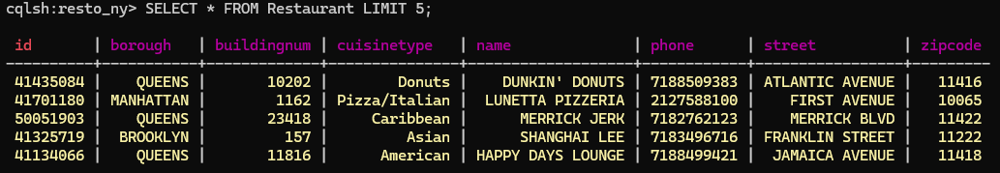
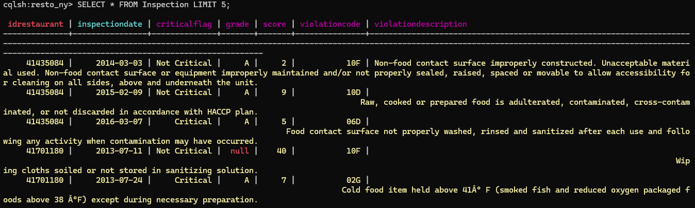
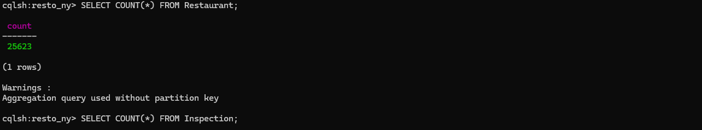
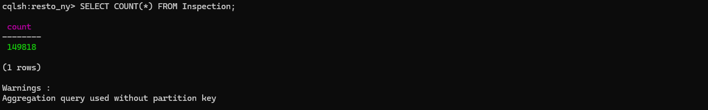

# project cassandra
## Run Cassandra in Docker
```sh
docker run --name mon-cassandra -d -p 9042:9042 cassandra
```
## اعادة تشغيل الحاوية
```sh
docker start mon-cassandra
```
## الدخول إلى واجهة أوامر Cassandra (cqlsh)
```sh
docker exec -it mon-cassandra cqlsh
```
## إنشاء قاعدة البيانات (Keyspace)
### داخل cqlsh:
```sh
CREATE KEYSPACE IF NOT EXISTS resto_ny 
WITH REPLICATION = { 'class': 'SimpleStrategy', 'replication_factor': 1 };

USE resto_ny;
```
## إنشاء الجداول
### جدول Restaurant:
```sh
CREATE TABLE Restaurant (
    id text PRIMARY KEY,
    name text,
    borough text,
    buildingnum text,
    street text,
    zipcode text,
    phone text,
    cuisinetype text
);
```
### جدول Inspection:
```sh
CREATE TABLE Inspection (
    idrestaurant text,
    inspectiondate text,
    violationcode text,
    violationdescription text,
    criticalflag text,
    score text,
    grade text,
    PRIMARY KEY (idrestaurant, inspectiondate)
);
```
## استيراد ملفات CSV إلى داخل الحاوية
```sh
docker cp "C:\Users\USERNAME\Downloads\restaurants.csv" mon-cassandra:/restaurants.csv
docker cp "C:\Users\USERNAME\Downloads\restaurants_inspections.csv" mon-cassandra:/restaurants_inspections.csv
```
## استيراد البيانات داخل cqlsh
```sh
COPY Restaurant (id, name, borough, buildingnum, street, zipcode, phone, cuisinetype)
FROM '/restaurants.csv' WITH DELIMITER=',' AND HEADER=TRUE;

COPY Inspection (idrestaurant, inspectiondate, violationcode, violationdescription, criticalflag, score, grade)
FROM '/restaurants_inspections.csv' WITH DELIMITER=',' AND HEADER=TRUE;
```
## Queries
### View 5 restaurants:
```sh
SELECT * FROM Restaurant LIMIT 5;
```

### View 5 inspections:
```sh
SELECT * FROM Inspection LIMIT 5;
```

### Count total restaurants:
```sh
SELECT COUNT(*) FROM Restaurant;
```

### Count total inspections:
```sh
SELECT COUNT(*) FROM Inspection;
```
